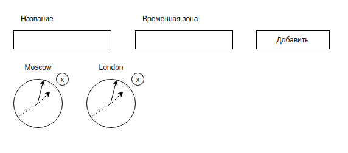

# Жизненный цикл и работа с HTTP

Необходимо выполнить и предоставить на проверку следующие задачи:

1. [Мировые часы](watches).
1. [CRUD](crud).
1. [Чат](chat) — необязательная задача.

Все три задачи лучше сдавать в разных репозиториях, то есть через create-react-app реализовать три проекта, чтобы не
было конфликта стилей. Но если вы позаботитесь о том, что конфликта не будет, то можете сдавать и в одном проекте.

Рекомендуем выполнять задачи с использованием классовых компонентов.

#### Альтернативный способ создания приложения React с использованием тулинга Vite

Приложение также можно создать используя инструмент Vite.
Документация по созданию приложения [React](https://vitejs.dev/guide/).

1. Откройте терминал и пропишите следующую команду: `yarn create vite my-app --template react`,
   либо `yarn create vite my-app --template react-ts`, если
   нужен шаблон с TypeScript. Эта команда создаст настроенный
   шаблонный проект.
2. Откройте созданный проект в своей IDE.
3. Установите зависимости.
4. Готово. Чтобы запустить приложение, введите команду: `yarn dev`(либо `npm run dev`).

# Мировые часы

Наверняка вы видели в офисах многих компаний установленные часы, показывающие время в разных столицах мира:

- New York,
- Moscow,
- London,
- Tokyo.

Общая механика:

1. Вы заполняете поля «Название» и «Временная зона», указываете смещение в часах относительно Гринвича и нажимаете кнопку «Добавить».
1. Часы автоматически добавляются и, что самое важное, начинают тикать, то есть отсчитываются секунды, минуты и часы.
1. При нажатии на крестик рядом с часами часы автоматически удаляются, при этом все подписки — `setTimeout`, `setInterval` и другие — должны вычищаться в соответствующем методе жизненного цикла.

Упрощения: если вам сложно реализовать механику со стрелками через css — см. `transform` и `rotate()`, то вы можете сделать цифровые часы, где отображаются только цифры в формате: ЧЧ:ММ:СС.

Подсказки:

1. Посмотреть текущий TimezoneOffset вы можете, используя объект `Date`.
1. Можете использовать библиотеку Moment.js.
